# Tkinter - the most popular Python library for creating GUI Applications

The Tkinter module in Python is a standard GUI (Graphical User Interface) toolkit that is easy to use and comes with Python. It provides a powerful object-oriented interface to the Tk GUI toolkit shipped with Python.

Tkinter is a wrapper around Tk, which is a graphical user interface toolkit that is used to create desktop applications. Tkinter provides a wide variety of ready-made dialog boxes and widgets, which can be used to build complex and attractive GUIs.

By default `tkinter` comes pre installed with python.

## Creating first GUI Application
There are two main methods used which the user needs to remember while creating the Python application with GUI.

#### Tk()
To create a main window, tkinter offers a method ‘Tk(screenName=None,  baseName=None,  className=’Tk’,  useTk=1)’. To change the name of the window, we can change the className to the desired one. This is the basic code used to create the main window of the application.

#### mainloop()
There is a method known by the name mainloop() is used when the application is ready to run. mainloop() is an infinite loop used to run the application, wait for an event to occur, and process the event as long as the window is not closed.

```python
import tkinter
m = tkinter.Tk()
'''
widgets are added here
'''
m.mainloop()
```

## Widgets
Widgets are the building blocks of the interface. Each widget serves a specific purpose and provides a way for users to interact with the application. Here’s a brief overview of some common widgets along with coding snippets demonstrating their use with specified dimensions.

###### Note :
+ All heights and widths are in pixels. 
+ The `pack()` method is used to display the widget on the tkinter interface. We will cover this mathod later.

###  Label
A label widget is used to display text or images in a window. It is often used for providing information to the user.

##### How to Use:
Click <a href="./label.py"> here </a>to see an example
+ Create a Label instance with the desired text and properties (e.g., background color, width, height).
+ Use the `.pack()` method to add it to the window.

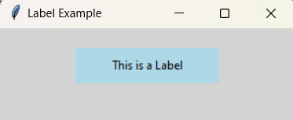

###   Button
The button widget is a clickable element that performs an action when clicked. It can also change state or update other widgets.

##### How to Use:
Click <a href="./button.py"> here </a>to see an example
+ Create a Button instance with the desired text and a command (function) to execute when clicked.
+ Use the `.pack()` method to add it to the window.

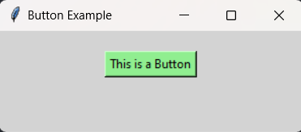

###   Entry
The entry widget allows users to input a single line of text. It is useful for getting short text inputs such as names or search queries.

##### How to Use:
Click <a href="./entry.py"> here </a>to see an example
+ Create an Entry instance and set properties like width and background color.
+ Use the `.pack()` method to add it to the window.
+ Retrieve the entered text with the `.get()` method.

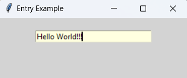

###   Check button
A checkbutton allows users to toggle a setting on or off. It can hold a binary state (checked or unchecked).

##### How to Use:
Click <a href="./checkbutton.py"> here </a>to see an example
+ Create a Checkbutton instance with a variable to store its state.
+ Use the `.pack()` method to add it to the window.
+ Access its state using the associated variable.

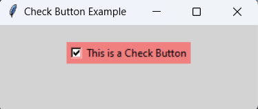

###   Radio button
Radio buttons allow the user to select one option from a group. Only one radio button in a group can be selected at a time.

##### How to Use:
Click <a href="./radiobutton.py"> here </a>to see an example
+ Create multiple Radiobutton instances, all linked to the same variable.
+ Use the `.pack()` method to add them to the window.
+ Access the selected option using the associated variable.

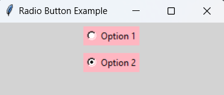

###   Listbox

A Listbox widget displays a list of items from which a user can select one or more items. The items can be strings or other types of data.

##### How to Use:
Click <a href="./listbox.py"> here </a>to see an example
+ Create a Listbox instance and add items using the `.insert()` method.
+ Use the `.pack()` method to add it to the window.
+ Retrieve the selected item(s) using the `.curselection()` method.

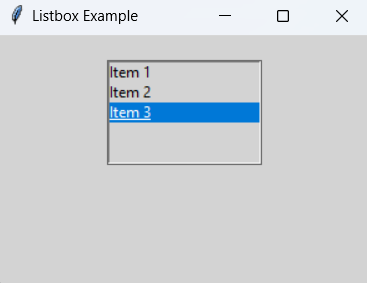

###   Scrollbar

A Scrollbar widget is used to provide scrolling capabilities for other widgets such as Listbox, Text, or Canvas. It can be oriented vertically or horizontally.

##### How to Use:
Click <a href="./scrollbar.py"> here </a>to see an example
+ Create a Scrollbar instance and link it to a Listbox or Text widget.
+ Use the `.pack()` method to add it to the window.
+ Connect the scrollbar's command to the widget's `.yview()` method.

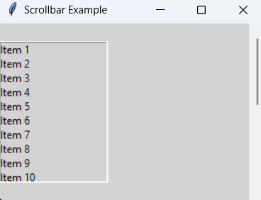

###   Menu

A Menu widget creates a menu bar that allows users to access commands and options. Menus can have multiple submenus and can be attached to the main application window.

##### How to Use:
Click <a href="./menu.py"> here </a>to see an example
+ Create a Menu instance and add commands (options) using `.add_command()`.
+ Attach the menu to the main window using the `.config()` method.

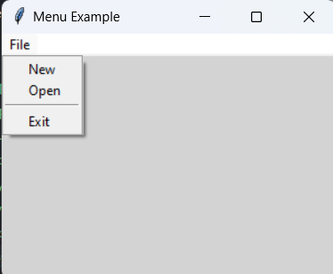

###   Canvas

A Canvas widget is used for drawing shapes, images, and other graphics. It provides a flexible area for custom graphics and can also contain other widgets.

##### How to Use:
Click <a href="./canvas.py"> here </a>to see an example
+ Create a Canvas instance with specified dimensions.
+ Use the .pack() method to add it to the window.
+ Draw shapes or text using methods like `.create_line()`, `.create_rectangle()`, or `.create_text()`.

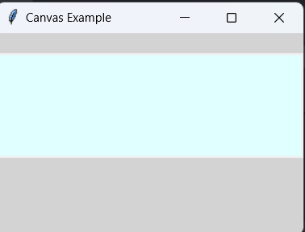

###   Combobox
A Combobox is a drop-down list that allows users to select from a list of options or enter their own input. It combines a dropdown list and an entry field. Users can either select an option or type their own value.
Supports autocomplete functionality.

##### How to Use:
Click <a href="./combobox.py"> here </a>to see an example
+ Create a Combobox instance and provide a list of options.
+ Use the `.pack()` method to add it to the window.
+ Access the selected value using the `.get()` method.

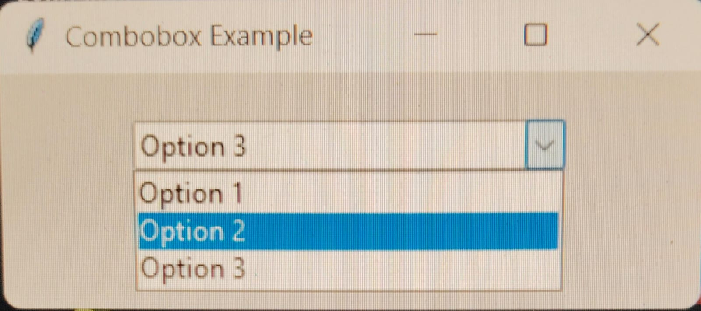

###  Scale

A Scale widget allows users to select a numeric value from a specified range using a slider. It supports both horizontal and vertical orientation. It can be configured to show ticks and labels.

##### How to Use:
Click <a href="./scale.py"> here </a>to see an example
+ Create a Scale instance with a range (min and max values).
+ Use the `.pack()` method to add it to the window.
+ Retrieve the selected value with the `.get()` method.

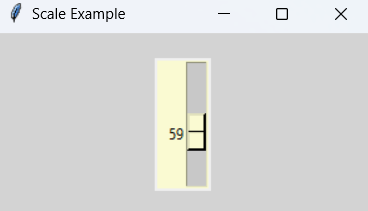

###   Toplevel
A Toplevel widget creates a new window that is separate from the main application window. It is useful for creating dialogs or secondary windows. It can contain any widgets like frames, buttons, etc.

##### How to Use:
Click <a href="./toplevel.py"> here </a>to see an example
+ Create a Toplevel instance when needed, typically from a button in the main window.
+ Add widgets to the Toplevel window like any other window.

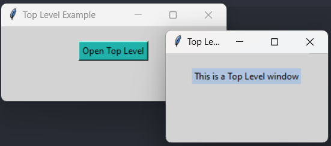

###   Message

A Message widget is similar to a Label, but it can display multi-line text and wraps text automatically. It automatically wraps text to fit within the widget.It is useful for displaying informational text or instructions.

##### How to Use:
Click <a href="./message.py"> here </a>to see an example
+ Create a Message instance and set its text.
+ Use the `.pack()` method to add it to the window.

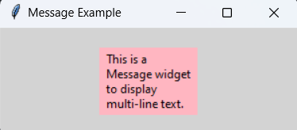

###   Menubutton

A Menubutton displays a menu when clicked. It is a button that can show a dropdown menu. It can be used to create context menus or dropdowns. It can contain multiple options.

##### How to Use:
Click <a href="./menubutton.py"> here </a>to see an example
+ Create a Menubutton instance and define a menu with options.
+ Use the `.pack()` method to add it to the window.

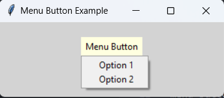

###   Progressbar
A Progressbar widget visually represents the progress of a task. It can be determinate (shows progress) or indeterminate (shows that a task is ongoing). It can display progress in a bar format. It supports both vertical and horizontal orientations.

##### How to Use:
Click <a href="./progressbar.py"> here </a>to see an example
+ Create a Progressbar instance, set its mode (e.g., determinate), and configure its length.
+ Use the `.pack()` method to add it to the window.
+ Update its value using the `.config()` method or `.step()` for determinate progress.

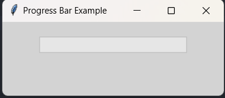

###   Spinbox

A Spinbox allows users to select from a range of values using up and down arrows. It can also accept user input. It can be configured with a range and step size. It allows direct input or selection.

##### How to Use:
Click <a href="./spinbox.py"> here </a>to see an example
+ Create a Spinbox instance with a specified range (minimum and maximum values).
+ Use the `.pack()` method to add it to the window.
+ Retrieve the selected value with the `.get()` method.

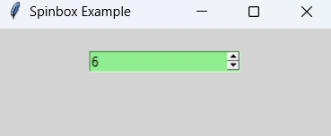

## Geometry Management

Efficiently managing the geometry of tkinter windows and widgets is essential for creating polished user interfaces. Here, we’ll explore methods like place(), grid(), and pack() to help set dimensions and create organized and responsive layouts.

###   pack()

The pack() method is a geometry manager that organizes widgets in blocks before placing them in the parent widget. It is the simplest method for layout management. Widgets can be packed in a vertical (side=tk.TOP, side=tk.BOTTOM) or horizontal (side=tk.LEFT, side=tk.RIGHT) direction.

We can specify whether the widget should fill the available space (fill parameter) and whether it should expand to fill any extra space in the parent widget (expand parameter).

Widgets are packed in the order they are created. The last widget packed will appear on top.

```python
import tkinter as tk

root = tk.Tk()

label1 = tk.Label(root, text="Label 1")
label1.pack(side=tk.TOP, fill=tk.X)

label2 = tk.Label(root, text="Label 2")
label2.pack(side=tk.TOP, fill=tk.X)

button = tk.Button(root, text="Click Me")
button.pack(side=tk.BOTTOM)

root.mainloop()
```

###   place()

The place() method allows you to specify the exact position of a widget in the parent widget. This method provides more control over widget placement than pack() and grid(). We can specify the x and y coordinates for the widget's position.

It also supports relative positioning using the relx and rely parameters (values between 0.0 and 1.0).

We can explicitly set the widget’s width and height.

```python
import tkinter as tk

root = tk.Tk()

label = tk.Label(root, text="I'm placed at (50, 50)")
label.place(x=50, y=50)

button = tk.Button(root, text="Button")
button.place(relx=0.5, rely=0.5, anchor=tk.CENTER)

root.mainloop()
```

###   grid()
The grid() method organizes widgets in a table-like structure using rows and columns. This method provides a flexible way to manage complex layouts. Each widget can be placed in a specific row and column using the row and column parameters.
We can span a widget across multiple rows or columns using the rowspan and columnspan parameters.
We can specify which sides of the cell the widget should stick to (north, south, east, west) using the sticky parameter.

```python
import tkinter as tk

root = tk.Tk()

tk.Label(root, text="Name:").grid(row=0, column=0, sticky=tk.W)
tk.Entry(root).grid(row=0, column=1)

tk.Label(root, text="Age:").grid(row=1, column=0, sticky=tk.W)
tk.Entry(root).grid(row=1, column=1)

tk.Button(root, text="Submit").grid(row=2, columnspan=2)

root.mainloop()
```
<hr>